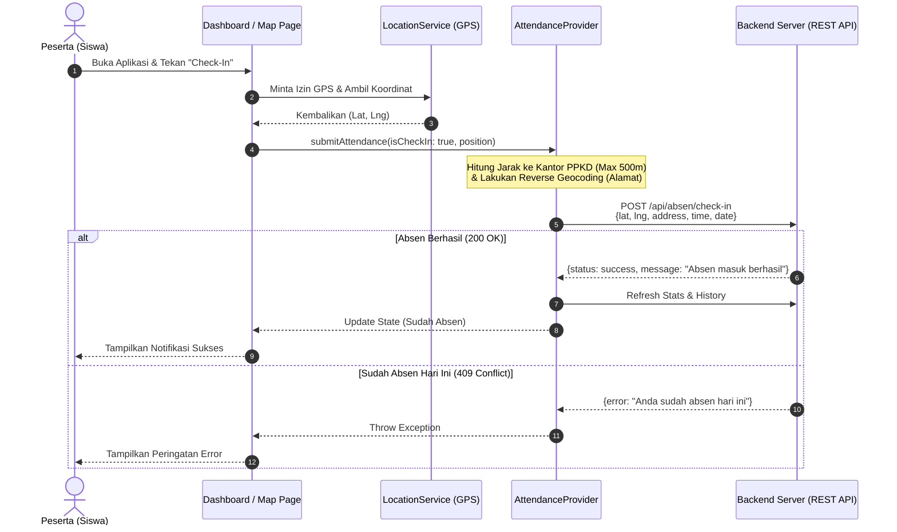
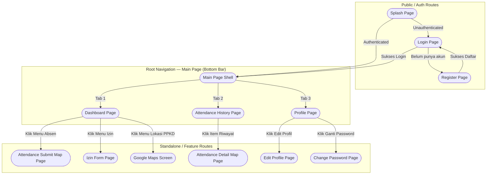

# 📋 Product Requirements Document (PRD) — Absensi PPKD (`absen_ah`)

## 1. Ringkasan Eksekutif & Informasi Produk

**Absensi PPKD (`absen_ah`)** adalah aplikasi sistem informasi absensi mobile berbasis **Flutter** yang dirancang khusus untuk mengelola kehadiran peserta pelatihan (siswa) di lingkungan **Pusat Pelatihan Kerja Daerah (PPKD)**. Aplikasi ini memanfaatkan teknologi **Geofencing (GPS)** dan **Reverse Geocoding** untuk memastikan validitas kehadiran peserta di area kampus pelatihan secara *real-time* dan akurat.

| Aspek | Detail Spesifikasi |
|---|---|
| **Nama Aplikasi** | Absensi PPKD (`absen_ah`) |
| **Versi Aplikasi** | `1.0.0+1` (SDK Flutter `^3.11.5`) |
| **Target Pengguna** | Peserta Pelatihan / Siswa PPKD & Admin/Instruktur |
| **Platform** | Android & iOS (Mobile Cross-Platform) |
| **Backend API** | REST API (`https://appabsensi.mobileprojp.com`) |
| **State Management** | `provider` (`ChangeNotifier`) |
| **Network & API Client** | `dio` v5.10.0 + `retrofit` v4.9.2 |
| **Geofencing / Maps** | `geolocator` v14.0.3, `geocoding` v4.0.0, `google_maps_flutter` v2.17.1 |
| **Keamanan Storage** | `flutter_secure_storage` v10.3.1 (JWT / Bearer Token) |
| **UI & Theme** | Material Design 3, Dynamic Dark/Light Mode, Custom Bottom Nav |

---

## 2. Latar Belakang & Tujuan Produk (Objectives)

### 2.1 Latar Belakang
Dalam lingkungan pelatihan kerja seperti PPKD, ketepatan waktu dan kehadiran fisik peserta merupakan syarat mutlak kelulusan dan sertifikasi. Sistem absensi manual (tanda tangan kertas) atau absensi digital tanpa verifikasi lokasi rentan terhadap manipulasi (titip absen) dan menyulitkan rekapitulasi data oleh instruktur.

### 2.2 Tujuan Utama (Key Objectives)
1. **Validasi Kehadiran Akurat (Geofencing)**: Memastikan peserta hanya dapat melakukan *Check-In* dan *Check-Out* apabila berada dalam radius yang diizinkan (**500 meter** dari titik koordinat kantor PPKD).
2. **Pencatatan Alamat Otomatis**: Mengubah koordinat GPS menjadi alamat teks secara otomatis (*Reverse Geocoding*) sebagai bukti fisik lokasi absensi.
3. **Digitalisasi Pengajuan Izin**: Mempermudah peserta mengajukan izin atau ketidakhadiran pelatihan secara terpusat langsung dari aplikasi mobile.
4. **Transparansi Data & Statistik**: Menyajikan statistik kehadiran harian dan riwayat absensi yang dapat difilter berdasarkan rentang tanggal.
5. **Kehandalan & Stabilitas Tinggi**: Menyediakan antarmuka yang responsif, mendukung Dark Mode, hemat memori (kompresi foto profil otomatis), serta tangguh terhadap gangguan jaringan atau sesi habis (*Auto-Logout* saat HTTP 401).

---

## 3. Arsitektur Codebase & Struktur Folder

Aplikasi dibangun dengan pola modular berbasis **Feature-driven & Layered Architecture** di dalam direktori `lib/`:

```
lib/
├── main.dart                          # Entry point, inisialisasi Provider & Theme
├── components/                        # Reusable UI Components
│   ├── absensi_card.dart              # Kartu riwayat & status absensi
│   ├── custom_text_field.dart         # Input field dengan kustomisasi tema
│   └── primary_button.dart            # Tombol aksi utama aplikasi
├── models/                            # Data Models (JSON Serializable / Retrofit)
│   ├── attendance_record.dart         # Model data absensi (check-in/out, lat/lng, alamat)
│   ├── auth_response.dart             # Respons profil & autentikasi
│   ├── login_response.dart            # Respons login (Token JWT + User Data)
│   ├── profile_response.dart          # Respons data profil detail
│   ├── register.dart                  # Payload & respons registrasi
│   ├── training_model.dart            # Model program pelatihan / batch
│   └── user_model.dart                # Model entitas pengguna (Peserta PPKD)
├── pages/                             # Application Screens / Views (13 Pages)
│   ├── splash_page.dart               # Layar pembuka & pengecekan sesi token
│   ├── login_page.dart                # Layar autentikasi masuk
│   ├── register_page.dart             # Layar pendaftaran peserta baru
│   ├── main_page.dart                 # Root Navigation (Floating Bottom Bar)
│   ├── dashboard_page.dart            # Dasbor utama (Statistik, Menu, Status Absen)
│   ├── attendance_history_page.dart   # Riwayat absensi + filter tanggal
│   ├── attendance_submit_map_page.dart# Peta interaktif konfirmasi titik absen
│   ├── attendance_detail_map_page.dart# Detail peta riwayat koordinat absen
│   ├── google_maps_screen.dart        # Layar eksplorasi lokasi kantor PPKD
│   ├── izin_form_page.dart            # Formulir pengajuan izin tidak hadir
│   ├── profile_page.dart              # Layar profil pengguna & menu pengaturan
│   ├── edit_profile_page.dart         # Form ubah biodata & foto profil
│   └── change_password_page.dart      # Form ubah kata sandi akun
├── providers/                         # State Management Layer (ChangeNotifier)
│   ├── attendance_provider.dart       # Logika bisnis absensi, geocoding, & izin
│   ├── auth_provider.dart             # Logika bisnis autentikasi & profil user
│   ├── language_provider.dart         # Pengaturan bahasa (ID / EN)
│   └── notification_settings_provider.dart # Preferensi notifikasi aplikasi
├── services/                          # Network & External Integration Layer
│   ├── api_service.dart               # Retrofit API interface definitions
│   ├── dio_client.dart                # Dio HTTP Client + Auth Interceptor
│   ├── location_service.dart          # GPS Permission & Geolocation Service
│   └── token_services.dart            # Secure storage handler untuk JWT
└── utils/                             # Constants & Helper Utilities
    ├── app_colors.dart                # Palet warna aplikasi
    ├── app_constants.dart             # Koordinat PPKD & Radius Geofence (500m)
    ├── helpers.dart                   # Utility formatting tanggal/waktu & error
    └── theme_controller.dart          # Pengelola Dark/Light Mode dinamis
```

---

## 4. Spesifikasi Kebutuhan Fungsional (Functional Requirements)

### 4.1 Modul Autentikasi & Manajemen Sesi (`F-01`)
* **`F-01.1` Registrasi Akun**: Calon peserta dapat mendaftar dengan memasukkan nama, email, kata sandi, serta memilih program pelatihan (*training/batch*).
* **`F-01.2` Login & Token Security**: Masuk menggunakan email dan kata sandi. Server mengembalikan token JWT yang disimpan secara terenkripsi menggunakan `flutter_secure_storage`.
* **`F-01.3` Auto-Logout (Interceptor)**: Jika sesi token berakhir atau tidak valid (HTTP Status `401` / `403`), sistem di `dio_client.dart` secara otomatis membersihkan token dan mengarahkan pengguna kembali ke `login_page.dart`.
* **`F-01.4` Logout**: Pengguna dapat keluar dari aplikasi, menghapus sesi lokal, dan mengosongkan *cache* state.

### 4.2 Modul Profil & Data Peserta (`F-02`)
* **`F-02.1` Tampilan Profil**: Menampilkan informasi biodata peserta (Nama, Email, Jenis Kelamin, Batch Pelatihan, Foto Profil).
* **`F-02.2` Pemutakhiran Biodata**: Peserta dapat mengubah nama atau memilih ulang program pelatihan (`edit_profile_page.dart`).
* **`F-02.3` Pemutakhiran Foto Profil (Optimasi Memori)**: Peserta dapat mengambil foto dari kamera atau galeri. Sistem menerapkan kompresi otomatis (Maksimal dimensi `800px`, kualitas `70%`) sebelum diubah ke format Base64 untuk mencegah *network lag* atau *timeout* saat upload ke server.

### 4.3 Modul Absensi Geofencing & Geocoding (`F-03`)
* **`F-03.1` Deteksi Koordinat GPS**: Saat peserta menekan tombol *Check-In* atau *Check-Out*, `location_service.dart` memeriksa izin lokasi dan mengambil koordinat akurat (`Latitude` & `Longitude`).
* **`F-03.2` Validasi Geofence**: Koordinat peserta dibandingkan dengan titik tengah kantor PPKD yang dikonfigurasi pada `app_constants.dart` (`-6.210491, 106.813218`). Batas toleransi maksimal adalah **500 meter**.
* **`F-03.3` Reverse Geocoding Otomatis**: Mengonversi koordinat GPS menjadi alamat jalan lengkap secara otomatis menggunakan *package* `geocoding` untuk dikirim ke server sebagai bukti `check_in_address` atau `check_out_address`.
* **`F-03.4` Pencegahan Duplikasi (Error 409)**: Sistem menangani respons HTTP `409 Conflict` dari server jika peserta mencoba melakukan *Check-In* lebih dari sekali pada hari yang sama.

### 4.4 Modul Pengajuan Izin / Cuti (`F-04`)
* **`F-04.1` Formulir Izin**: Peserta yang berhalangan hadir dapat mengisi formulir izin di `izin_form_page.dart` dengan menentukan tanggal dan menuliskan alasan ketidakhadiran.
* **`F-04.2` Sinkronisasi Status**: Pengajuan izin yang berhasil akan langsung memperbarui statistik total izin dan riwayat absensi pada dasbor utama.

### 4.5 Modul Peta Interaktif / Maps (`F-05`)
* **`F-05.1` Peta Lokasi PPKD**: Menampilkan penanda (*marker*) lokasi kantor PPKD beserta area cakupan geofence di Google Maps (`google_maps_screen.dart`).
* **`F-05.2` Peta Konfirmasi Absensi**: Memungkinkan peserta melihat posisi mereka secara visual di peta sebelum mengirimkan data absensi masuk atau pulang (`attendance_submit_map_page.dart`).
* **`F-05.3` Peta Riwayat Absen**: Melihat kembali titik lokasi di mana peserta melakukan absensi pada hari-hari sebelumnya (`attendance_detail_map_page.dart`).

### 4.6 Modul Riwayat & Statistik Kehadiran (`F-06`)
* **`F-06.1` Dasbor Statistik Kehadiran**: Menampilkan ringkasan numerik pada `dashboard_page.dart`:
  * Total Hari Absen
  * Total Hadir / Masuk
  * Total Izin
  * Status Absen Hari Ini (Sudah / Belum)
* **`F-06.2` Filter Riwayat berdasarkan Tanggal**: Pada `attendance_history_page.dart`, peserta dapat memfilter daftar kehadiran berdasarkan rentang tanggal (*Start Date* hingga *End Date*).
* **`F-06.3` Manajemen Catatan**: Mendukung penghapusan catatan absensi tertentu (sesuai hak akses/aturan server).

### 4.7 Modul Pengaturan & Preferensi UX (`F-07`)
* **`F-07.1` Dynamic Theme (Dark / Light Mode)**: Dukungan tema gelap dan terang yang dikontrol melalui `theme_controller.dart` dan disimpan secara persisten di `SharedPreferences`.
* **`F-07.2` Multi-bahasa (i18n)**: Pengguna dapat beralih antara Bahasa Indonesia dan Bahasa Inggris melalui `language_provider.dart`.
* **`F-07.3` Pengaturan Notifikasi**: Preferensi pengingat absensi yang diatur pada `notification_settings_provider.dart`.

---

## 5. Alur Kerja & Diagram Navigasi (UX Flow)

### 5.1 Alur Autentikasi & Check-In Harian


### 5.2 Peta Navigasi Aplikasi (Route Map)


---

## 6. Standar Kualitas & Audit Compliance (Production Readiness)

Berdasarkan laporan audit teknis (`Bug_Fixing_Audit_Report.md`), aplikasi **`absen_ah`** telah memenuhi standar *Production Ready* dengan perbaikan kritis yang telah diterapkan:

1. **Stabilitas Navigasi & Race Condition**: Eliminasi *race condition* pada saat pengecekan token di `splash_page.dart` dengan memastikan pemeriksaan `context.mounted` sebelum melakukan transisi halaman.
2. **Penanganan Error 401 Global**: Implementasi *Interceptor* di `dio_client.dart` yang secara otomatis mendeteksi kedaluwarsa token dan membersihkan sesi tanpa membuat UI *freeze* atau *stuck*.
3. **Pencegahan Memory Leak & Blank Screen**: Perbaikan alur navigasi root pada `profile_page.dart` menggunakan pengecekan `Navigator.canPop()`, serta penerapan kompresi gambar maksimal 800px pada `auth_provider.dart`.
4. **Kepatuhan SDK & Deprecation Free**: Pembaruan seluruh properti usang (seperti penggantian `withOpacity` menjadi `withValues` pada Flutter 3.11+) serta penanganan *async gap* di seluruh berkas proyek.

---

## 7. Rencana Pengembangan Lanjutan (Roadmap & Future Scope)

| Fase | Nama Fitur | Deskripsi | Target Implementasi |
|---|---|---|---|
| **Fase 2** | **Biometric Face Recognition** | Menambahkan verifikasi pengenalan wajah (*liveness check*) menggunakan kamera depan saat melakukan *Check-In* untuk mencegah *spoofing* atau titip absen sesama peserta. | Q3 2026 |
| **Fase 3** | **Push Notification (FCM)** | Integrasi Firebase Cloud Messaging untuk mengirimkan pengingat otomatis (pukul 07:30 untuk absen masuk dan pukul 16:00 untuk absen pulang). | Q4 2026 |
| **Fase 4** | **Export Laporan PDF/Excel** | Memungkinkan peserta dan instruktur mengunduh rekapitulasi riwayat kehadiran bulanan dalam format PDF atau Excel langsung dari ponsel. | Q1 2027 |
| **Fase 5** | **Offline Caching & Background Sync** | Menyimpan data absensi sementara di SQLite saat jaringan terputus di area minim sinyal, dan menyinkronkannya otomatis saat sinyal kembali normal. | Q2 2027 |
